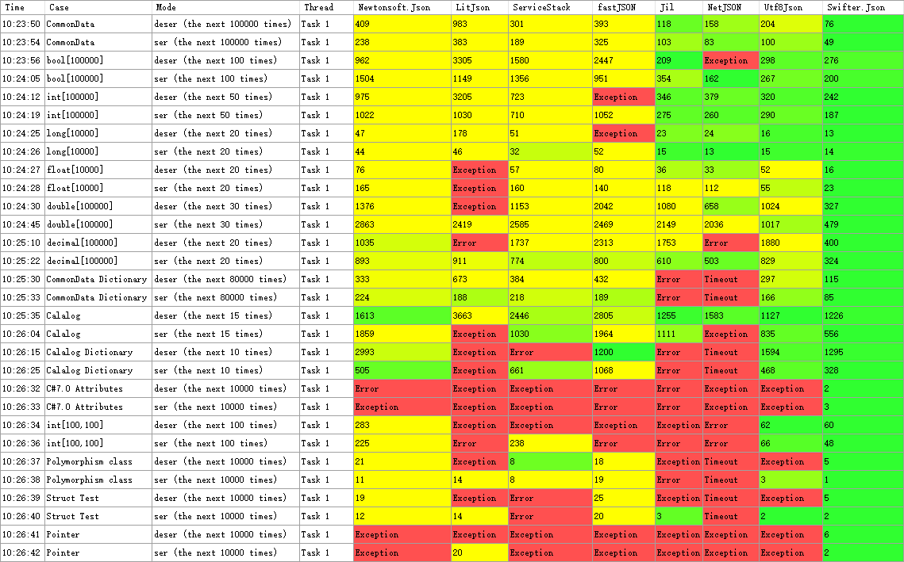
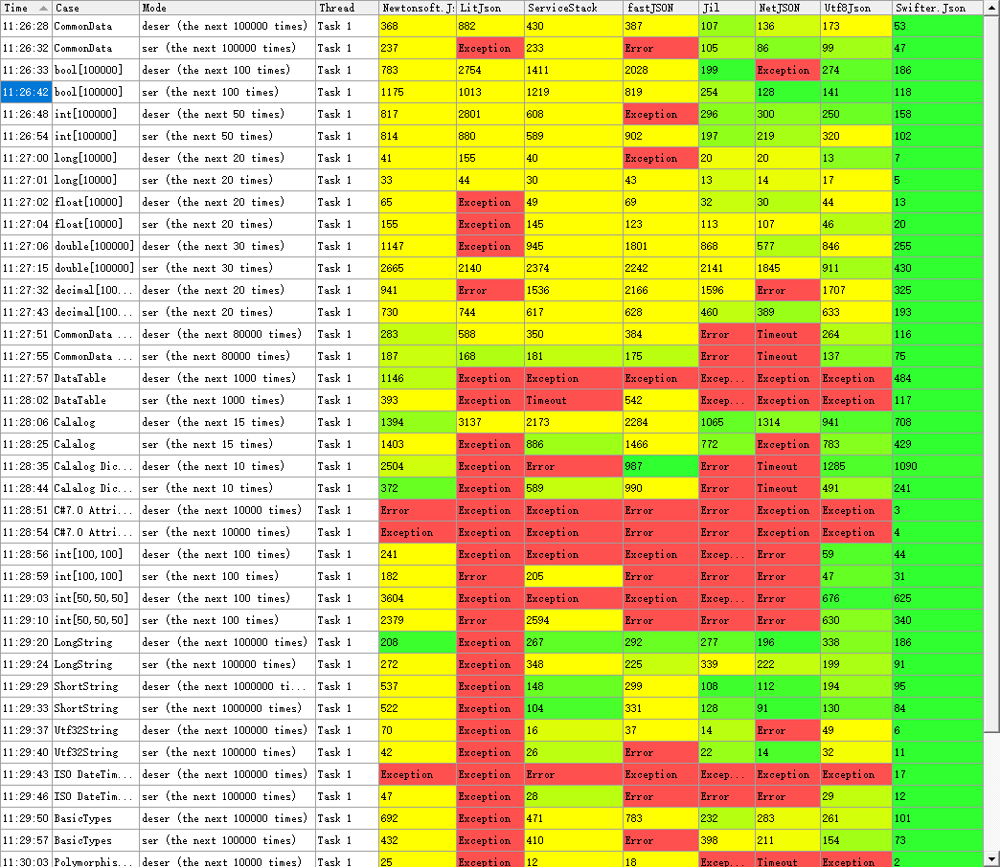
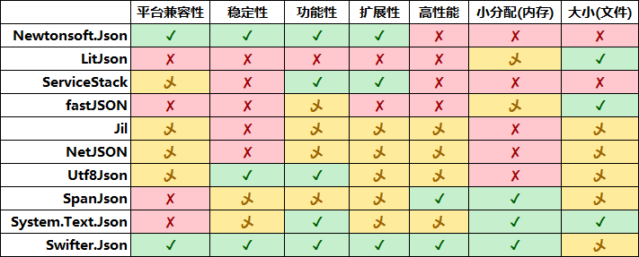

# Swifter.Json

### [Github](https://github.com/Dogwei/Swifter.Json)

### [Wiki](https://github.com/Dogwei/Swifter.Json/wiki)

### [如果您打算使用 Swifter.Json，请在 Nuget 包管理上安装](https://www.nuget.org/packages/Swifter.Json/)

### [如果您需要单文件的 DLL，请点击这里下载](https://github.com/Dogwei/Swifter.Json/tree/master/Swifter.Merged)

#### 在 .Net 平台上的一个功能强大，简单易用，稳定又不失高性能的 JSON 序列化和反序列化工具。

## Swifter.Json 强大之处
#### 1：支持 .Net 已知所有对象结构，包括深度循环结构，引用类型属性等。
#### 2：支持几乎所有常用的数据类型，并多方案轻松自定义类型的序列化行为，后续将持续增加。
#### 3：支持缩进 Json，忽略 Null 值 0 值 "" 值等，支持使用 { "$Ref" : "#/Target" } 表示重复引用，或将循环引用序列化为 Null 等，支持设置最大深度。
#### 4：支持 .Net Core 2.0+，.Net Framework 2.0+，.Net Standard 2.0+，Xamarin，Unify，Mono 等平台。
#### 5：Swifter.Json 几乎是无 BUG 的，因为它已有多个上线项目在运行，且每次发布都会经过我们自己单元测试和 Newtonsoft.Json 和 Spanjson 的单元测试来确保它的稳定性，如果您遇到了问题，可以在 Github 上发布一个 issue，我们会尽力帮助您。
#### 6：完整全面的 API 中文文档，每个公开的类型和方法都有中文说明，也有 Github 上的 Wiki 文档 (现主要维护文档)。

## 部分 .Net 现有的 JSON 工具性能对比

#### .Net Core 3.0 Previews running results.



#### .Net Framework 4.7.1 Previews running results.



###### 图中的数字代表用时(ms). 表格颜色随用时从 绿色 渐变为 黄色。当用时超过 3 倍时将以亮黄色显示。
###### Swifter.Json 第一次执行需要额外的时间来生成一个 “操作类(FastObjectRW&lt;T&gt;)” 后续会越来越快。所以如果您的程序需要长期运行，那么 Swifter.Json 是您优的选择。如果您的程序不适用这种模式，那么 Swifter.Reflection 的 XObjectRW&lt;T&gt; 也许适合您，详情请看 Wiki。

## 与其他库对比对比



###### 平台兼容性     ✓：兼容大多数平台的大多数版本；乄：兼容部分平台，且版本要求较高；✗：只能在单一平台上运行。
###### 稳定性         ✓：在大多数测试中未出现 BUG；乄：一些不常见操作会出现 BUG；✗：常见操作会出现 BUG。
###### 功能性         ✓：支持大多数的数据类型和方法；乄：支持常用的数据类型和方法；✗：部分常用数据类型和方法不支持。
###### 扩展性         ✓：高度允许自定义格式和处理方式；乄：支持常用的格式设置；✗：不能自定义格式。
###### 高性能         ✓：相比 Newtonsoft 平均快 4x 以上；乄：相比 Newtonsoft 平均快 2x 以上；✗：相比 Newtonsoft 差不多或者更慢。
###### 小分配(内存)   ✓：执行过程中分配的内存极少；乄：必要的内存占用较少；✗：执行过程中分配的大量的临时内存。
###### 大小(文件)     ✓：小于 100KB；乄：大于 100KB 小于 500 KB；✗：大于 500 KB。

#### 简单使用

```C#
    public class Demo
    {
        public int Id { get; set; }

        public string Name { get; set; }

        public static void Main()
        {
            var json = JsonFormatter.SerializeObject(new { Id = 1, Name = "Dogwei" });
            var dic = JsonFormatter.DeserializeObject<Dictionary<string, object>>(json);
            var obj = JsonFormatter.DeserializeObject<Demo>(json);
        }
    }
```

## 更新历史

### 1.2.1 更新:

#### 1：再度提高性能 (主要原理是对不常见行为禁止内联，提高常见行为的内联成功率)。
#### 2：解决枚举序列化出错，ValueInterface&lt;T&gt;.SetInterface() 不起作用等 BUG。
#### 3：增加特性定义 (反)序列化行为 ([RWFormat], [RWField], [RWObject] 等特性)。
#### 4：增加 AspNetCore 的扩展方法 ConfigureJsonFormatter(this IServiceCollection services)。现在可以很方便将 Swifter.Json 配置到 MVC 了。
#### 5：新增 JsonValue 类，此类可以表示 JSON 反序列化时的任何值（包括对象和数组）。

### 1.2.2 更新:

#### 1：增加了异步方法，JsonFormatter 中以 Async 结尾的方法均为异步方法。
#### 2：修改 Swifter.Extensions.AspNetCore 的扩展使用异步方法。


### 1.2.5 更新：

#### 1：因为更新时疏忽了 Swifter.Core 的引用关系，所以跳过了 1.2.3 和 1.2.4 版本。
#### 2：增加了对类似 1_000_1000 这样的数字值的支持。
#### 3：允许字符串键和值不使用引号包裹！（这样的字符串不能使用前后空格，也不能使用转义符）
#### 4：终于魔鬼战胜了天使，Swifter.Json 终于牺牲的部分性能，成了完全验证的 Json 解析器（除了点 2 和点 3）。


### 1.2.9 更新：
#### 1: 合并 JsonDeserializer 和 JsonSerializer -- 在之前版本中，JsonDeserializer 和 JsonSerializer 都有两种模式：1：在默认配置下执行快速的操作；2：在指定了缩进 Json 或引用序列化配置后执行普通的序列化，以前这两种模式由不同的类实现，现在将它们合并，在内部进行判断。理论上，这样做会影响性能，在早期版本的 .Net Freamework 中影响明显，但在新版本 .Net 中因为优化编译，所以影响并不大。这样做的好处是减少代码冗余，无需维护两套代码。
#### 2: 优化异步方法。异步方法内部使用 HGlobalCache 类实现，使用者可以直接使用 HGlobalCache 进行序列化和反序列化，性能更佳。
#### 3: 解决重构时产生的一些 BUG。
#### 4: 优化 DataTable 反序列化性能，并在测试中增加 DataTable 的测试。

### 1.2.9.4 更新：
#### 1: 将 JsonFormatter 中的重载函数改用 .tt 模板文件生成，里面的重载方法太多了。
#### 2: 解决重构时产生的一些 BUG。
#### 3: 修改默认配置:开启字段序列化，当反序列化的字段不存在时不发生异常。
#### 4: 新增图标，并修复因将图标打包至 DLL 导致 DLL 过大的问题。

### 1.2.9.5 更新：
#### 1: 修复 Mono 反序列化出错的问题。
#### 2: 修复 Swifter.Extensions.AspNetCore 上报 encoding 不能为 null 的问题。
#### 3: Swifter.Extensions.AspNetCore 增加 .Framework 4.5 MVC 和 .NetCore 3.0 MVC 的支持。
